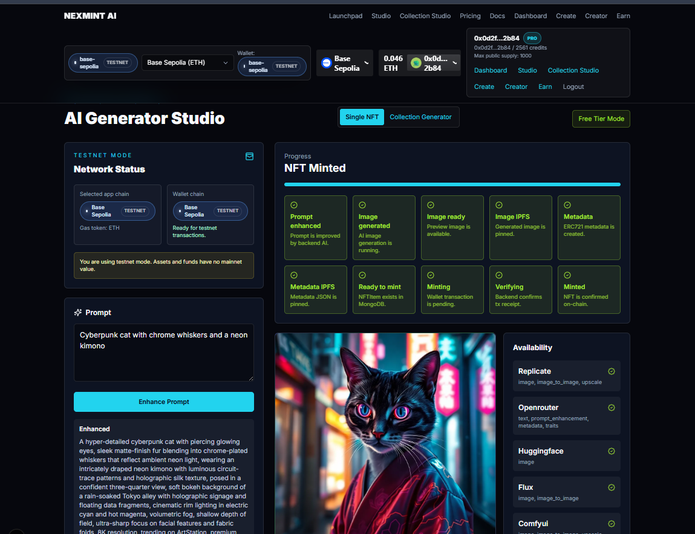
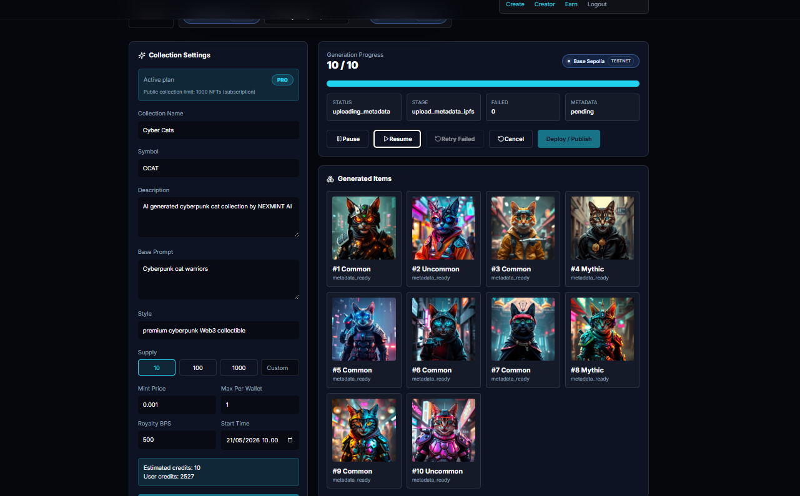
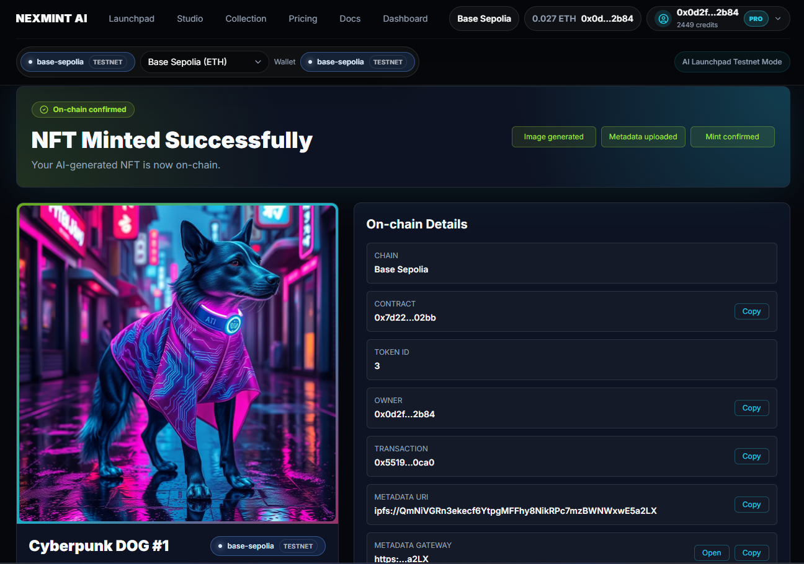
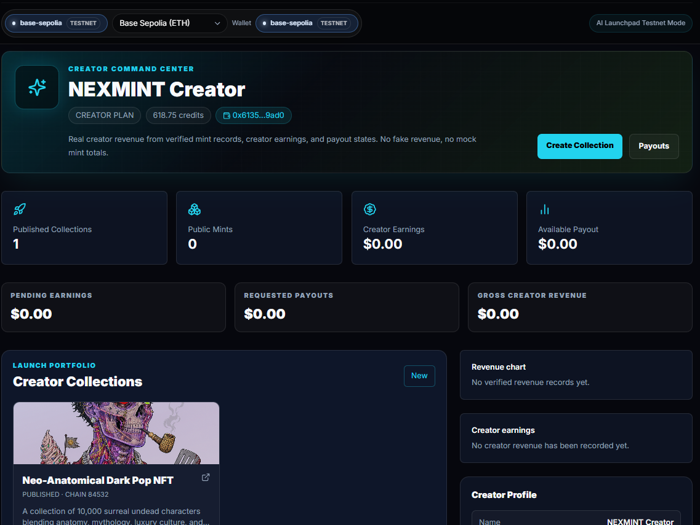
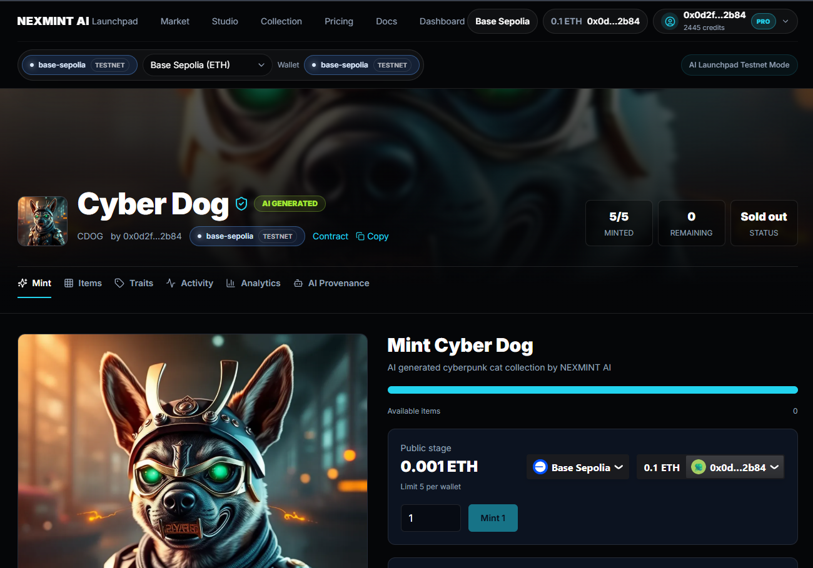

# NEXMINT AI


NEXMINT AI is a production-oriented SaaS starter for an AI-powered Web3 NFT generator and launchpad. It includes a Next.js 15 frontend, Express API, MongoDB models, BullMQ workers, modular AI providers, IPFS uploads, ERC721A launch contracts, and a crypto-only payment system.

## Screenshots

Replace these placeholders with real screenshots before submitting grant applications.







## Demo Flow

1. Connect wallet.
2. Generate a single NFT.
3. Upload image and metadata to IPFS.
4. Mint using the default NEXMINT single NFT contract.
5. Generate a collection.
6. Upload collection images and metadata to IPFS.
7. Validate metadata `baseURI`.
8. Deploy ERC721A collection.
9. Publish launchpad.
10. Public users mint.

## Account Wallet Linking

Email users can link a wallet from the dashboard. NEXMINT asks the connected wallet to sign a short-lived message, then the backend verifies that signature before saving the wallet to the user account. This is gasless and does not authorize spending.

Linked wallets are used for minting, marketplace actions, likes, creator collection management, and creator payout defaults. See [Account Wallet Linking](docs/account-wallet-linking.md).

## Current Status

- Single NFT generation: prototype / testnet-ready
- Collection generation: prototype / in progress
- IPFS metadata flow: in progress
- ERC721A contracts: testnet-ready
- Launchpad minting: testnet prototype
- Marketplace: fixed-price testnet prototype with basic analytics
- Mainnet production: not yet audited

## Pricing and Fair Use

NEXMINT uses a credit-based pricing model to prevent unlimited AI generation and protect operational costs.

- Free / Testnet: 5 credits/month, 512px only, collection tests up to 5 NFTs
- Starter: $9/month, 120 credits/month, 768px, collections up to 50 NFTs
- Creator: $29/month, 600 credits/month, collections up to 300 NFTs, 1 launchpad publish/month
- Pro: $99/month, 2500 credits/month, 1024px, collections up to 1000 NFTs, 5 launchpad publishes/month

Credit costs are enforced server-side. Frontend plan displays are informational only. See [Pricing and Credits](docs/pricing.md) and [Fair Use Policy](docs/FAIR_USE_POLICY.md).

## Marketplace Roadmap

NEXMINT marketplace support is planned as a staged rollout after minting.

- **Phase 1:** External marketplace and explorer links after mint. Users can view minted NFTs on explorers and supported external marketplaces while indexing catches up.
- **Phase 2:** Internal fixed-price marketplace for NFTs minted through the default single NFT contract and launchpad ERC721A collections, including collection profile management, likes, trending discovery, collection pages, asset detail pages, floor price, total volume, trade history, top collections, recent activity, blockchain details, price panels, and fixed-price Buy Now.
- **Phase 3:** Offers after the fixed-price flow is reviewed and tested.
- **Phase 4:** Auctions.
- **Phase 5:** Analytics, floor price, and richer activity feeds.

Backend trade status must come from verified receipts and marketplace events; the backend must not custody user NFTs or mark trades successful from frontend-only state.

See [Marketplace Roadmap](docs/MARKETPLACE_ROADMAP.md), [Marketplace Architecture](docs/MARKETPLACE_ARCHITECTURE.md), and [Marketplace V1](docs/MARKETPLACE_V1.md).

## Creator Badges

NEXMINT supports trust and discovery badges across marketplace, launchpad, and creator management screens:

- Blue checkmark: verified creator or verified collection, assigned by NEXMINT/admin review.
- Pink `PRO` badge: creator has an active Pro or Enterprise plan.

Badges are derived from backend user and collection records, not frontend-only state. They may also contribute a small discovery/trending signal later.

## Grant Proposal Links

- [One-page grant proposal](docs/grant-proposal-one-page.md)
- [Short grant proposal](docs/grant-proposal-short.md)
- [Reusable grant application answers](docs/grant-application-answers.md)

## License & Commercial Use

This repository is source-available for transparency, grant review, and educational purposes.

Commercial use, resale, hosted SaaS deployment, or launching a competing product based on this code requires written permission from the maintainer.

For commercial licensing or partnership inquiries, contact:
[ADD CONTACT EMAIL]

See [LICENSE](LICENSE) and [NOTICE.md](NOTICE.md).

## Open-Core Roadmap

NEXMINT AI uses an open-core strategy.

Public repository may include:

- README and documentation
- frontend UI prototype
- smart contract templates
- demo architecture
- `.env.example` without secrets
- grant proposal documents
- basic API skeleton
- testnet/demo flows

Private production modules may include:

- AI provider routing logic
- payment verification production logic
- deployer/private-key flow
- admin dashboard
- revenue/treasury production logic
- premium plan and credit system
- anti-abuse and rate-limit logic
- provider fallback strategy
- production IPFS/Filebase implementation
- billing and subscription logic
- monitoring and operational tooling

This lets reviewers understand the project while protecting production business logic. See [Open-Core Split Plan](docs/OPEN_CORE_SPLIT_PLAN.md) and [Private Production Modules](docs/PRIVATE_MODULES.md).

## Public vs Private Architecture

The intended repository split is:

- **Public:** `https://github.com/Dem9x/nextmint`
- **Private:** `https://github.com/Dem9x/nextmint-platform`

The public repo should stay useful for grants, demos, education, and technical review. The private repo should contain production-specific modules, operational safeguards, commercial SaaS logic, deployment controls, and secrets-managed infrastructure.

Do not commit real secrets to either repository. Keep `.env.example` public, but keep `.env`, deployer keys, provider API keys, database URLs, RPC tokens, and production credentials private.

## Architecture

```text
apps/web              Next.js 15 App Router UI, wallet UX, dashboards
apps/api              Express API, MongoDB, Redis, queues, AI/IPFS/Web3 services
packages/contracts    Hardhat Solidity contracts and deployment scripts
packages/shared       Shared TypeScript types and constants
infra                 Docker, Nginx, PM2, Ubuntu deployment assets
docs                  Architecture and production runbooks
```

## Crypto-Only Payments

Stripe is intentionally absent. Credits, subscriptions, mint fees, and treasury revenue use on-chain payments. In local development the app runs in testnet mode across Base Sepolia, Ethereum Sepolia, Arbitrum Sepolia, and BSC Testnet. The backend verifies transaction receipts, validates payment events, tracks confirmations, and grants credits or subscription access only after verification.

## No Mock Dashboard Policy

Dashboards must render only backend API data. If a collection has no transactions, mints, earnings, or treasury records yet, the frontend shows loading, error, or empty states such as “No data yet”. It must not render fake revenue, fake chart points, fake APR, demo balances, or hardcoded growth numbers.

Real dashboard sources include MongoDB records, verified crypto transactions, NFT mint records, AI usage logs, credit ledgers, subscription records, treasury balance syncs, BullMQ-backed activity, and pricing snapshots.

## Authentication And Sessions

NEXMINT AI supports email/password and wallet-signature authentication. No frontend mock user is used.

Auth env:

```env
JWT_SECRET=replace-with-a-strong-secret
JWT_EXPIRES_IN=7d
AUTH_NONCE_EXPIRES_MINUTES=10
BCRYPT_ROUNDS=12
NEXT_PUBLIC_APP_URL=http://localhost:3000
NEXT_PUBLIC_API_URL=http://localhost:4000
```

Auth APIs:

```bash
POST /api/auth/register
POST /api/auth/login
GET /api/auth/me
POST /api/auth/logout
POST /api/auth/wallet/nonce
POST /api/auth/wallet/verify
```

Wallet login flow:

1. Frontend connects wallet.
2. Backend creates a one-time nonce message with wallet, chain id, nonce, and issued timestamp.
3. User signs the exact message.
4. Backend verifies the signature, consumes the nonce, creates or loads the user, stores the wallet connection, and returns a JWT.
5. Frontend restores the session through `/api/auth/me` on refresh.

JWTs are currently stored in browser localStorage for the local app flow. This is simple for a wallet-heavy SPA, but production deployments should prefer an httpOnly secure cookie if the frontend and API are served from compatible domains.

Protected frontend routes include dashboard, studio/generator, mint, earn, admin, settings, and collection creation. Protected backend APIs require JWT auth, and admin APIs require the admin role.

## Loading And Generation UX

The app includes route skeletons and premium loading states for page refreshes, dashboard metrics, pricing quotes, Studio provider state, generation polling, IPFS preparation, and mint verification.

User-facing loading states have a five-second minimum display time so transitions feel stable, while completion states still depend only on real API, queue, IPFS, or blockchain confirmation results.

Cat loader components:

- `GenerateCatLoader`: prompt/image generation.
- `IpfsCatLoader`: image and metadata upload.
- `MintCatLoader`: wallet mint transaction.
- `TransactionCatLoader`: backend tx verification.

Generation status labels:

- `image_ready`: generated image preview is ready.
- `ready_to_mint`: IPFS image and metadata are ready.
- `minted`: backend verified the on-chain mint transaction.

The UI never shows “NFT Minted” until `/api/nft/verify-mint` confirms the transaction and saves token id, chain id, tx hash, and contract address.

## Crypto Pricing Engine

Pricing is server-side. The frontend requests quotes and only formats the returned values.

Providers:

- CoinGecko primary, with optional `COINGECKO_API_KEY`.
- CoinMarketCap fallback when `COINMARKETCAP_API_KEY` is configured.
- DefiLlama fallback through `DEFILLAMA_BASE_URL`.
- Manual admin override through platform settings for emergency use only.

Pricing APIs:

```bash
GET /api/pricing/tokens
GET /api/pricing/token/ETH?chainId=84532
GET /api/pricing/quote?chainId=84532&token=ETH&usdAmount=10
POST /api/pricing/quote-payment
GET /api/pricing/plans
GET /api/pricing/providers/health
```

Every created crypto payment stores the quote values at payment time: token amount, USD amount, provider, price timestamp, and quote expiry. Historical USD values are not recalculated with later prices.

## Revenue And Earnings

Revenue streams are modeled as first-class records: credit purchases, subscriptions, mint fees, launch fees, deploy fees, and overage fees. Fee percentages and plan/package prices live in `PlatformSettings`, not frontend code.

Creator and user earning records are separated:

- Withdrawable: creator earnings, referral rewards when configured as withdrawable, affiliate commissions.
- Non-withdrawable: bonus credits, promo credits, onboarding credits, referral bonus credits.

Payouts are admin-reviewed by default:

```bash
POST /api/earnings/request-payout
GET /api/admin/payouts
POST /api/admin/payouts/:id/approve
POST /api/admin/payouts/:id/reject
POST /api/admin/payouts/:id/mark-paid
```

Referral attribution accepts referral codes during email registration or wallet login. Self-referrals and duplicate referral attribution are blocked.

## Launchpad And Public Mint Campaigns

NEXMINT AI supports creator launchpad campaigns, not only one-off AI NFT minting. The production flow is:

1. Creator creates a collection at `/collections/create`.
2. Creator configures name, symbol, max supply, mint price, chain, max mint per wallet, royalty, payout wallet, and public mint schedule.
3. Creator uploads or generates collection metadata and sets `metadataBaseUri`.
4. Creator deploys a `NexmintCollectionERC721A` contract from `/collections/:id/manage`.
5. Creator pays the NEXMINT publish fee through the treasury payment contract.
6. Backend verifies the publish fee transaction on-chain.
7. Creator publishes the collection to `/launchpad`.
8. Public users open `/launchpad/:slug`, connect wallet, and mint with `publicMint(quantity)`.
9. Backend verifies the mint transaction, extracts real `Transfer` and `PublicMinted` events, records `MintRecord`, `CreatorEarning`, and `PlatformRevenue`, and updates real minted supply.

Collection statuses:

```text
draft -> metadata_ready -> contract_pending -> contract_deployed -> publish_fee_pending -> published -> minting_live -> sold_out
```

A collection is visible on the public launchpad only when all of these are true: contract address exists, chain id exists, metadata base URI exists, publish fee is verified, public mint is enabled, and status is `published`, `minting_live`, or `sold_out`.

Launchpad APIs:

```bash
POST /api/collections
PATCH /api/collections/:id/config
POST /api/collections/:id/deploy
POST /api/collections/:id/publish-quote
POST /api/collections/:id/verify-publish-fee
POST /api/collections/:id/publish
GET /api/launchpad/collections
GET /api/launchpad/collections/:slug
POST /api/launchpad/collections/:id/verify-mint
```

Mint revenue is split in the collection contract. `publicMint(quantity)` sends the configured platform fee to the platform treasury and the creator share to the creator payout wallet, then emits `PublicMinted` and `RevenueSplit`. Backend revenue records are created only after receipt verification; no fake supply, tx hash, token id, or revenue is written.

Plan gating is enforced by the backend. Free users can create drafts but cannot deploy or publish public campaigns. Starter defaults to max supply 100, Pro defaults to max supply 1000, and Enterprise can be configured higher through `PlatformSettings.maxSupplyByPlan`.

### Collection Generator Mode

Use `/studio/collection` for Model A launchpad collections:

1. Creator enters base prompt, collection info, chain, supply, mint price, schedule, and royalty.
2. Backend checks plan limits and available credits with `GET /api/collections/generation-quote`.
3. `POST /api/collections/generate` creates `NFTCollection` and `CollectionGenerationJob`, reserves credits, and queues generation.
4. The worker rolls weighted traits, prevents duplicate trait hashes, generates each unique image, uploads each image to IPFS, creates `1.json ... supply.json`, uploads the metadata directory, and sets `metadataBaseUri`.
5. The collection remains blocked from deploy/publish until status is `metadata_ready`.
6. ERC721A uses `baseURI + tokenId + ".json"` and starts token ids at `1`, so `tokenURI(1)` resolves to `ipfs://METADATA_CID/1.json`.

Collection generation APIs:

```bash
GET /api/collections/generation-quote?supply=1000&provider=replicate
POST /api/collections/generate
GET /api/collections/:id/generation-status
GET /api/collections/:id/items?page=1&limit=50&status=metadata_ready
POST /api/collections/:id/pause-generation
POST /api/collections/:id/resume-generation
POST /api/collections/:id/cancel-generation
```

The UI never shows fake items. If 137 of 1000 images are done, progress shows exactly `137 / 1000`; failed tokens are stored as failed `NFTItem` records and the collection is not marked `metadata_ready`.

## Hidden Treasury Withdraw

The treasury withdraw UI is intentionally hidden at `/admin/treasury-withdraw` and is not linked from the navbar. Access requires:

- authenticated user role `admin`
- wallet login/primary wallet matching the connected wallet
- connected wallet must match the on-chain `TreasuryPayments.owner()`

Withdraw transactions are signed in the browser by the owner/deployer wallet. The backend never sends a withdraw transaction with a private key.

```env
ADMIN_WITHDRAW_ADDRESSES=0xAdminWallet1,0xAdminWallet2
```

`ADMIN_WITHDRAW_ADDRESSES` is kept as an operator context allowlist for audits and future multisig flows; the current contract can only withdraw from the actual on-chain owner address.

## Revenue Dashboards

Dashboard APIs aggregate real records:

```bash
GET /api/dashboard/user/summary
GET /api/dashboard/creator/summary
GET /api/admin/dashboard/summary
GET /api/dashboard/revenue-chart?range=30d&chainId=all
GET /api/dashboard/mint-chart?range=30d&chainId=all
GET /api/dashboard/ai-usage-chart?range=30d
GET /api/dashboard/earnings-chart?range=30d
```

Treasury sync:

```bash
GET /api/admin/treasury/balances
POST /api/admin/treasury/sync
```

AI usage economics store credits charged and estimated provider cost. If provider cost is unknown, the stored value is `null` and the dashboard displays “cost unavailable”.

## Testnet Mode

Supported testnets:

| Network | Chain ID | Gas token | Explorer |
| --- | ---: | --- | --- |
| Base Sepolia | 84532 | ETH | https://sepolia.basescan.org |
| Ethereum Sepolia | 11155111 | ETH | https://sepolia.etherscan.io |
| Arbitrum Sepolia | 421614 | ETH | https://sepolia.arbiscan.io |
| BSC Testnet | 97 | tBNB | https://testnet.bscscan.com |

Required app envs:

```env
DEFAULT_CHAIN_ID=84532
ENABLE_TESTNET_MODE=true
BASE_SEPOLIA_RPC_URL=
SEPOLIA_RPC_URL=
ARBITRUM_SEPOLIA_RPC_URL=
BSC_TESTNET_RPC_URL=
BASE_SEPOLIA_PAYMENT_CONTRACT=
SEPOLIA_PAYMENT_CONTRACT=
ARBITRUM_SEPOLIA_PAYMENT_CONTRACT=
BSC_TESTNET_PAYMENT_CONTRACT=
BASE_SEPOLIA_NFT_FACTORY=
SEPOLIA_NFT_FACTORY=
ARBITRUM_SEPOLIA_NFT_FACTORY=
BSC_TESTNET_NFT_FACTORY=

NEXT_PUBLIC_DEFAULT_CHAIN_ID=84532
NEXT_PUBLIC_ENABLE_TESTNET_MODE=true
NEXT_PUBLIC_BASE_SEPOLIA_RPC_URL=
NEXT_PUBLIC_SEPOLIA_RPC_URL=
NEXT_PUBLIC_ARBITRUM_SEPOLIA_RPC_URL=
NEXT_PUBLIC_BSC_TESTNET_RPC_URL=
NEXT_PUBLIC_BASE_SEPOLIA_PAYMENT_CONTRACT=
NEXT_PUBLIC_SEPOLIA_PAYMENT_CONTRACT=
NEXT_PUBLIC_ARBITRUM_SEPOLIA_PAYMENT_CONTRACT=
NEXT_PUBLIC_BSC_TESTNET_PAYMENT_CONTRACT=
NEXT_PUBLIC_BASE_SEPOLIA_NFT_FACTORY=
NEXT_PUBLIC_SEPOLIA_NFT_FACTORY=
NEXT_PUBLIC_ARBITRUM_SEPOLIA_NFT_FACTORY=
NEXT_PUBLIC_BSC_TESTNET_NFT_FACTORY=
```

Get faucet funds from the official ecosystem faucets for Sepolia ETH, Base Sepolia ETH, Arbitrum Sepolia ETH, and BNB Chain testnet tBNB. Never send mainnet funds to testnet contracts.

Deploy contracts per chain:

```bash
npm --workspace @nexmint/contracts run deploy-payment:base-sepolia
npm --workspace @nexmint/contracts run deploy-payment:sepolia
npm --workspace @nexmint/contracts run deploy-payment:arbitrum-sepolia
npm --workspace @nexmint/contracts run deploy-payment:bsc-testnet

npm --workspace @nexmint/contracts run deploy-factory:base-sepolia
npm --workspace @nexmint/contracts run deploy-factory:sepolia
npm --workspace @nexmint/contracts run deploy-factory:arbitrum-sepolia
npm --workspace @nexmint/contracts run deploy-factory:bsc-testnet
```

Set the `*_PAYMENT_CONTRACT` env values from `deploy-payment:*`. Set the `*_NFT_FACTORY` / `NEXT_PUBLIC_*_NFT_FACTORY` values from `deploy-factory:*` if you want the factory address exposed in network metadata. Creator collection deployments are also supported directly from the backend through `POST /api/collections/:id/deploy`, using the per-chain private key env.

The frontend network switcher persists the selected app chain and asks the wallet to switch when it does not match. Backend verification rejects unsupported chains, chain mismatches, missing receipts, wrong recipients, duplicate tx hashes, low amounts, and transactions without enough confirmations.

Troubleshooting:

- Wrong network: use the header network switcher or the banner button.
- Missing RPC URL: set the matching backend and frontend RPC env.
- Missing contract address: deploy `TreasuryPayments`, then set the per-chain payment contract env.
- Tx hash not found: confirm the tx was sent on the selected chain.
- Chain mismatch: verify `chainId` in the payment request matches the wallet chain.
- Unsupported chain: testnet mode only allows `84532`, `11155111`, `421614`, and `97`.
- Wallet switch rejected: switch manually in the wallet and retry.

## AI Providers

All AI calls run on the backend. API keys are never sent to the browser.

### Replicate

1. Create a Replicate account.
2. Generate an API token from your Replicate account settings.
3. Set `REPLICATE_API_TOKEN`.
4. Choose defaults with:

```env
AI_DEFAULT_IMAGE_PROVIDER=replicate
REPLICATE_DEFAULT_TEXT_TO_IMAGE_MODEL=black-forest-labs/flux-schnell
REPLICATE_DEFAULT_UPSCALE_MODEL=
REPLICATE_DEFAULT_IMAGE_TO_IMAGE_MODEL=
```

Replicate is used for text-to-image, reference image workflows, upscaling, and image variations. The backend normalizes Replicate outputs whether the model returns a string, array, object, or file-like value.

### OpenRouter

1. Create an OpenRouter account.
2. Generate an API key.
3. Set `OPENROUTER_API_KEY`.
4. Use free mode with:

```env
AI_DEFAULT_TEXT_PROVIDER=openrouter
OPENROUTER_DEFAULT_MODEL=openrouter/free
AI_FREE_TIER_MODE=true
AI_MAX_DAILY_FREE_REQUESTS=50
```

OpenRouter is used for prompt enhancement, negative prompts, NFT trait descriptions, collection lore, metadata descriptions, rarity story generation, and fallback text. If OpenRouter is missing, rate-limited, or over free quota, text enhancement falls back to a deterministic local template. Image generation does not fake success when quota is exhausted.

### AI API Examples

```bash
curl -X POST "$API_ORIGIN/api/ai/enhance-prompt" \
  -H "Authorization: Bearer $JWT" \
  -H "Content-Type: application/json" \
  -d '{"prompt":"cyberpunk cat","style":"premium Web3 collectible"}'

curl -X POST "$API_ORIGIN/api/ai/generate-image" \
  -H "Authorization: Bearer $JWT" \
  -H "Content-Type: application/json" \
  -d '{"prompt":"cyberpunk cat","provider":"replicate","model":"black-forest-labs/flux-schnell","width":1024,"height":1024}'
```

### AI Fallback Behavior

- Image priority: Replicate, FLUX, HuggingFace, ComfyUI.
- Text priority: OpenRouter, local template fallback.
- Every request logs provider, model, status, latency, fallback use, free-tier flag, and prompt hash to `AIUsageLog`.

## AI Image to NFT Pipeline

Generated images are not treated as minted NFTs. The Studio uses explicit stages:

1. `image_ready`: AI image exists and can be previewed.
2. `uploading_image_ipfs`: backend uploads the generated image to Pinata.
3. `uploading_metadata_ipfs`: backend creates ERC721 metadata and uploads JSON to IPFS.
4. `ready_to_mint`: MongoDB has an `NFTItem` with image and metadata IPFS URIs.
5. `minted`: backend verified the wallet transaction and saved `tokenId`, `txHash`, `chainId`, and `contractAddress`.

NFT endpoints:

```bash
curl -X POST "$API_ORIGIN/api/nft/prepare-from-generation" \
  -H "Authorization: Bearer $JWT" \
  -H "Content-Type: application/json" \
  -d '{"generationId":"...","name":"Cyberpunk Cat #1","description":"AI generated NFT from NEXMINT AI"}'

curl -X POST "$API_ORIGIN/api/nft/verify-mint" \
  -H "Authorization: Bearer $JWT" \
  -H "Content-Type: application/json" \
  -d '{"nftItemId":"...","chainId":84532,"contractAddress":"0x...","txHash":"0x..."}'
```

`verify-mint` only returns `minted` after it finds a confirmed ERC721 `Transfer` event to the recipient wallet. No fake token IDs, tx hashes, or IPFS CIDs are generated.

Single NFT Studio minting uses a direct metadata token URI such as `ipfs://IMAGE_METADATA_CID`. This is different from launchpad collections, which use a folder base URI such as `ipfs://METADATA_FOLDER_CID/` and `tokenURI(1) = ipfs://METADATA_FOLDER_CID/1.json`.

The active Studio mint modes are:

- `Mint with NEXMINT default contract`: wallet-native mint through the preconfigured single NFT minter for the selected chain.
- `Export metadata only`: copy/download image and metadata IPFS URIs for external minting.

Custom contract minting and deploying a new single NFT contract from Studio are visible as Coming Soon. In default mode, the frontend does not show a manual contract input and the backend does not trust a frontend contract address. The default minter is resolved from env/server config.

```env
NEXT_PUBLIC_SINGLE_NFT_MINTER_BASE_SEPOLIA=
NEXT_PUBLIC_SINGLE_NFT_MINTER_BASE_MAINNET=
NEXT_PUBLIC_SINGLE_NFT_MINTER_SEPOLIA=
NEXT_PUBLIC_SINGLE_NFT_MINTER_POLYGON_AMOY=

SINGLE_NFT_MINTER_BASE_SEPOLIA=
SINGLE_NFT_MINTER_BASE_MAINNET=
SINGLE_NFT_MINTER_SEPOLIA=
SINGLE_NFT_MINTER_POLYGON_AMOY=
```

After a successful single NFT mint, Studio links to `/nft/:nftItemId`. The result page fetches real data from `GET /api/nft/items/:id` and shows the NFT image, attributes, IPFS URIs, chain, contract, token id, owner wallet, tx hash, and explorer links. Minted NFTs are publicly readable; unminted prepared NFTs require the owner session and are never shown as successful mints.

IPFS uploads use Filebase by default for generated images, so temporary Replicate/HuggingFace/Flux URLs are copied to durable IPFS before the frontend sees them:

```env
IPFS_PROVIDER=filebase
FILEBASE_ACCESS_KEY=
FILEBASE_SECRET_KEY=
FILEBASE_BUCKET=
FILEBASE_S3_ENDPOINT=https://s3.filebase.com
FILEBASE_GATEWAY=https://ipfs.filebase.io/ipfs

PINATA_JWT=
PINATA_GATEWAY_URL=https://gateway.pinata.cloud/ipfs
PINATA_GATEWAY_TOKEN=
NFT_STORAGE_TOKEN=
NFT_STORAGE_GATEWAY_URL=https://nftstorage.link/ipfs
```

Create a Filebase IPFS bucket, then add the access key, secret key, and bucket name to the backend env. `generation.imageUrl` and `NFTItem.imageUrl` are stored as Filebase/IPFS gateway URLs; metadata JSON still uses `ipfs://IMAGE_CID`.

Collection metadata folder uploads require a real directory CID so `tokenURI(1)` resolves to `ipfs://METADATA_CID/1.json`. Until Filebase RPC directory upload is implemented, the app keeps Pinata legacy folder upload as the metadata directory fallback when `IPFS_PROVIDER=filebase`. Do not fake a Filebase baseURI from unrelated single-file CIDs.

Use `IPFS_PROVIDER=nft_storage` to force NFT.Storage. Use `IPFS_PROVIDER=auto` to use Filebase for images when configured and fall back to the older providers. NFT.Storage API keys stay backend-only. NFT.Storage Classic upload availability has changed over time, so if a new token cannot upload, use the current Web3.Storage/Storacha free-tier path and keep the backend provider boundary the same.

Pinata notes:

- Single image and JSON uploads use Pinata V3 `uploads.pinata.cloud/v3/files` on the public network.
- Collection metadata folder uploads still use legacy `pinFileToIPFS` because Pinata's V3 upload endpoint does not support folder uploads yet.
- If your Pinata key is scoped only for legacy endpoints or only for V3 endpoints, create a new key with both upload scopes or set `IPFS_PROVIDER=auto` with `NFT_STORAGE_TOKEN` as fallback.
- `pinataGatewayToken` from a gateway URL is read-only and cannot upload. `PINATA_JWT` must be the API JWT from Pinata API Keys with `org:files:write` for V3 uploads.
- If a dedicated Pinata gateway shows `ERR_ID:00024`, configure the gateway read token with `PINATA_GATEWAY_TOKEN` or include `?pinataGatewayToken=...` in `PINATA_GATEWAY_URL`, then restart the API. On-chain metadata should stay as `ipfs://...`; the tokenized gateway URL is only for web previews.
- Use `PINATA_UPLOAD_MODE=v3`, `legacy`, or `auto` to control upload behavior. `PINATA_NETWORK=public` is required for public NFT metadata.

Treasury and credit economics:

- `GET /api/admin/treasury/balances` lists synced treasury balances.
- `POST /api/admin/treasury/sync` syncs configured testnet native balances.
- Admin stats include credits sold, credits spent, remaining credit liability, estimated AI provider cost, and gross margin estimate. Unknown provider cost is stored and shown as `null`.

## Subscription Duration

Paid plans are duration-based and activate only after on-chain payment verification.

- Free: unlimited, no expiry, preview only.
- Starter Monthly: 30 days, 100 credits, max 100 NFT public collection.
- Starter Yearly: 365 days, 1200 credits, max 100 NFT public collection.
- Pro Monthly: 30 days, 500 credits, max 1000 NFT public collection.
- Pro Yearly: 365 days, 6000 credits, max 1000 NFT public collection.
- Enterprise: custom duration and expiry set by admin.

Subscription APIs:

```bash
curl -X POST "$API_ORIGIN/api/subscription/quote" \
  -H "Authorization: Bearer $JWT" \
  -H "Content-Type: application/json" \
  -d '{"planId":"pro-monthly","chainId":84532,"token":"NATIVE"}'

curl -X POST "$API_ORIGIN/api/subscription/verify-payment" \
  -H "Authorization: Bearer $JWT" \
  -H "Content-Type: application/json" \
  -d '{"paymentId":"pay_...","chainId":84532,"txHash":"0x..."}'

curl "$API_ORIGIN/api/subscription/status" \
  -H "Authorization: Bearer $JWT"
```

When the same active plan is renewed before expiry, `expiresAt` extends from the current expiry date. Expired users automatically fall back to Free through the subscription expiry worker, but old NFTs, collections, and dashboard data remain viewable.

### AI Troubleshooting

- `401`: OpenRouter API key is invalid.
- `402`: OpenRouter account requires credits or payment.
- `429`: provider rate limit reached; text enhancement falls back locally.
- Replicate timeout: increase `AI_IMAGE_GENERATION_TIMEOUT_MS` or choose a faster model.
- No image output: check the model adapter and Replicate model output shape.
- Empty OpenRouter response: router uses local fallback for text tasks.

## Local Start

For the shortest setup path, see [docs/QUICK_START.md](docs/QUICK_START.md).
For MongoDB Atlas and Redis cloud setup without Docker, see [docs/CLOUD_SERVICES.md](docs/CLOUD_SERVICES.md).

1. Copy `.env.example` to `.env` and fill secrets.
2. Install dependencies with `npm install`.
3. Start MongoDB and Redis with `docker compose up mongo redis`.
4. Compile contracts with `npm run contracts:compile`.
5. Run apps with `npm run dev`.

## Production

Use Vercel for `apps/web`, Docker or PM2 for `apps/api`, MongoDB Atlas or a managed replica set, managed Redis, Pinata for IPFS, and dedicated RPC providers for each chain. See [docs/DEPLOYMENT.md](docs/DEPLOYMENT.md).
